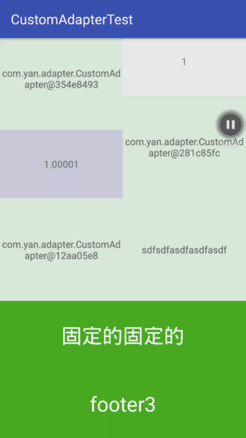

# CustomAdapter
## 可随意定制的RecycleView 适配器
#### 1.支持多类型
#### 2.支持header和footer（适配网格布局和流布局，可控制隐藏与显示）
#### 3.支持添加状态如：获取数据失败、网络没有连接等（可控制隐藏与显示）

# include lib
    Gradle:
    
      
# how to use    

##1.添加普通的数据类型    

        //添加普通的数据类型 CustomAdapterItem<T,V> T为holder的类型，V为数据类型
        .addAdapterItem(new CustomAdapterItem<HolderTest1, Integer>() {
            @Override
            public Class dataType() {
                return Integer.class;//直接返回数据类型，这里并没有根据V的泛型判断数据类型，毕竟反射影响运行效率
            }
            @Override
            public HolderTest1 viewHolder(ViewGroup parent) {
                return new HolderTest1(
                    LayoutInflater.from(MainActivity.this).inflate(R.layout.item_type_1, parent, false)
                );
            }
            @Override
            public void bindData(HolderTest1 holder, Integer item, int position) {
                holder.textView.setText(item + "");
            }
        })

##2.添加状态类型

          //添加状态类型 StateAdapterItem<HolderTest2>(String tag, boolean isShow) tag是标签，便于之后找到这个item；isShow为是否显示
          .addAdapterItem(new StateAdapterItem<HolderTest2>("NO_WIFI", false) {
              @Override
              public HolderTest2 viewHolder(ViewGroup parent) {
                  HolderTest2 holderTest2 = new HolderTest2(
                      LayoutInflater.from(MainActivity.this).inflate(R.layout.state_view, parent, false)
                  );
                  holderTest2.textView.setText("确保网络连接正常");
                  return holderTest2;
              }
          })
            //在recycleview初次加载的时候，不可见的item并不会执行createviewholder，所以如果你需要对item做动态修改最好以传参的方式传入viewholder
          .addAdapterItem(new StateAdapterItem<HolderTest2>("DataError", false,
                        getHolder()) {
                    @Override
                    public HolderTest2 viewHolder(ViewGroup parent) {
                        return null;
                    }
                })
                //------------------------------------------------
                 private HolderTest2 getHolder() {//这里布局大小需要自己给定
                    RecyclerView.LayoutParams layoutParams = new RecyclerView.LayoutParams(RecyclerView.LayoutParams.MATCH_PARENT,
                            RecyclerView.LayoutParams.MATCH_PARENT);
                    View view = LayoutInflater.from(MainActivity.this).inflate(R.layout.state_view, null);
                    view.setLayoutParams(layoutParams);
                    HolderTest2 holderTest2 = new HolderTest2(view);
                    holderTest2.textView.setText("获取数据出错");
                    return holderTest2;
                }
                //------------------------------------------------

##3.添加header和footer
        
            //添加header
            .addAdapterItem(new StateAdapterItem<HolderTest2>(StateAdapterItem.HEADER) 
             //添加footer
            .addAdapterItem(new StateAdapterItem<HolderTest2>(StateAdapterItem.FOOTER) 
    
##4.动态更改数据

                 StateAdapterItem dataError = adapter.findStateItem("DataError");
                 //以参数形式传入的ViewHolder不会出现viewholder为空的情况
                 ((HolderTest2) dataError.getHolder()).textView.append("!");
                 ((HolderTest2) adapter.getStateFooter().getHolder())
                        .textView.setText("footer" + times);
                 StateAdapterItem noWifi = adapter.findStateItem("NO_WIFI");
                 if (noWifi.getHolder() != null)
                      ((HolderTest2) noWifi.getHolder()).textView.append(".");
                 StateAdapterItem noData = adapter.findStateItem("NO_DATA");
                 if (noData.getHolder() != null)
                      ((HolderTest2) noData.getHolder()).textView.append("-");
                  
##5.控制显示与隐藏

            adapter.findStateItem("FIXED").hide();
                //或者
                adapter.show("DataError")
                        .hide("NO_WIFI")
                        .hide("NO_DATA")
                            .hideHeader(false)//false不立即执行
                            .hideFooter(false)
                            .commit();
##6.点击事件

         adapter.setOnDataItemClickListener(new OnItemClickListener() {
                    @Override
                    public void onItemClick(RecyclerView.ViewHolder holder, int position) {
                        ((HolderTest) holder).textView.append(position + "");
                        toast.setText("onItemClick: position " + position);
                        toast.show();
                    }
                });

## LICENSE

    Copyright 2017 yan

    Licensed under the Apache License, Version 2.0 (the "License");
    you may not use this file except in compliance with the License.
    You may obtain a copy of the License at

        http://www.apache.org/licenses/LICENSE-2.0

    Unless required by applicable law or agreed to in writing, software
    distributed under the License is distributed on an "AS IS" BASIS,
    WITHOUT WARRANTIES OR CONDITIONS OF ANY KIND, either express or implied.
    See the License for the specific language governing permissions and
    limitations under the License.

